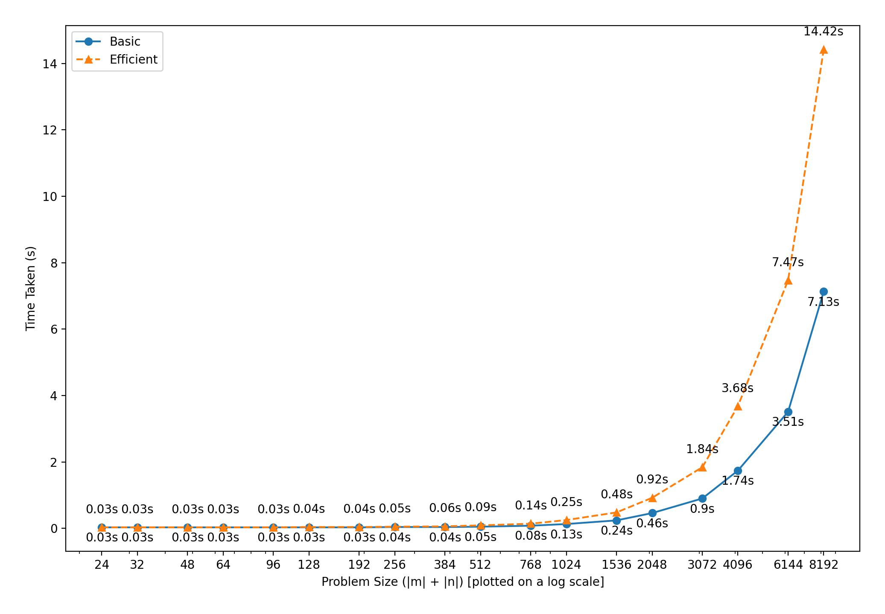
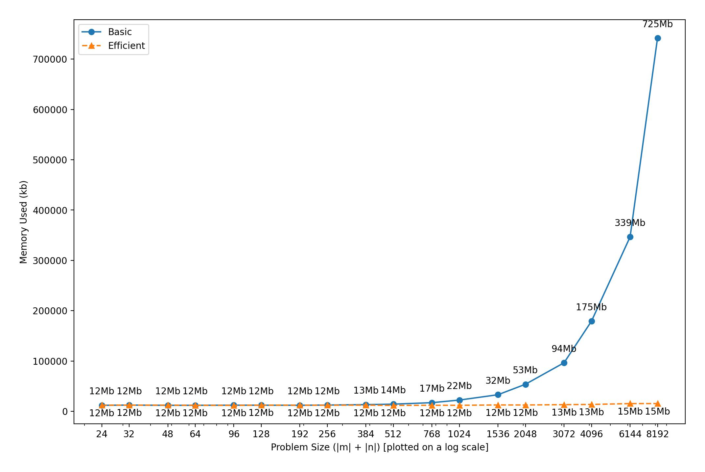

# CSCI 570 Project: Sequence Alignment

This repository contains the code for two different solutions of the *Sequence Alignment* problem from the *Algorithm Design* textbook by Jon Kleinberg and Éva Tardos.

A description of the problem can be found on the dynamic programming slides from the book's [website](https://www.cs.princeton.edu/~wayne/kleinberg-tardos/).


## Usage

A description of the input file `input.txt` required can be found in the [project description](./project.pdf).

The scripts can be run through the following commands:
```bash
./5840387942_6161762888_basic.sh
./5840387942_6161762888_efficient.sh
```

Running the scripts will generate the output file `output.txt` which contains the solution as required by the project description.


## Results

CPU Usage:


Memory Usage


## Project Team

- [Raaj Patil](https://www.github.com/arrpee)
- [Raajitha Rajkumar](https://www.github.com/raajraj)

